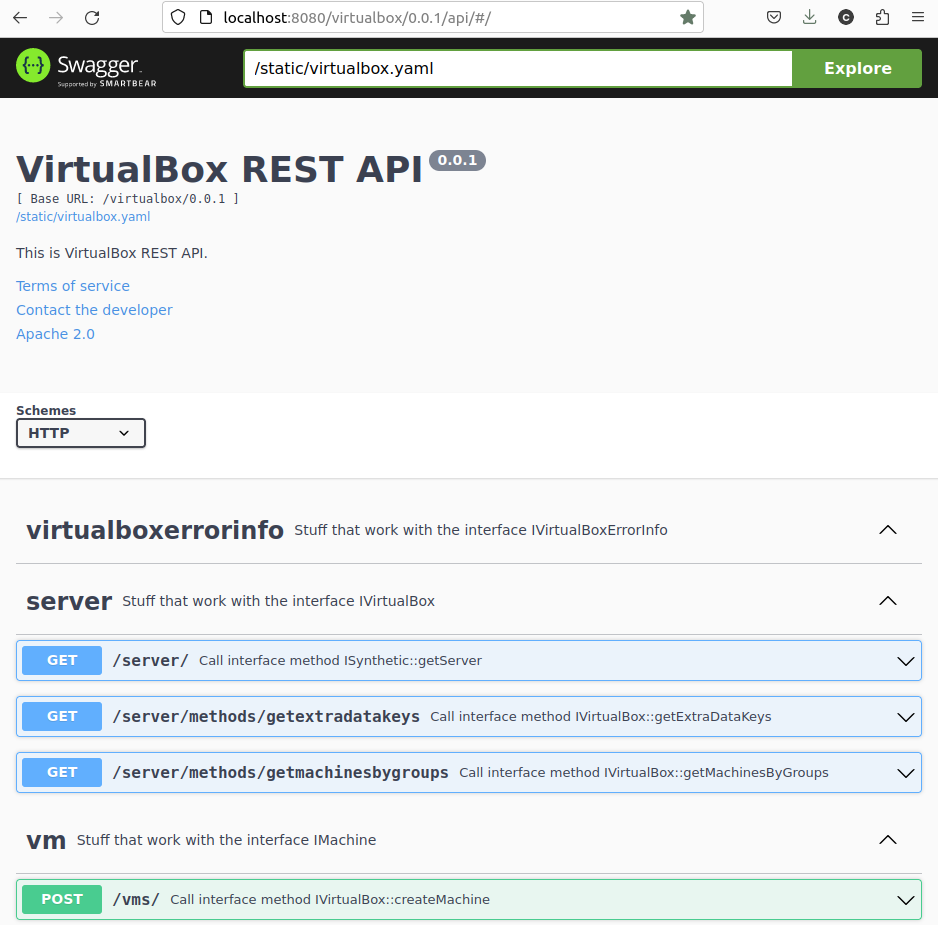

# VirtualBox Swagger/OpenAPI server

## Project name
VirtualBox Swagger/OpenAPI server

## Description
The project is intended to help VirtualBox users interact with VirtualBox server remotely. The standard example is web browser where user opens the home page of VirtualBox server and does some actions with VMs or get\set some information related to VMs.

## Prerequisities
- Python 3.8, 3.9, 3.10, 3.11

## Current API version
0.0.2

## Getting Started

### Downloading VirtualBox SDK
- Download an appropriate VirtualBox SDK as a standalone package.
- Unpack SDK.
    > **NOTE!**
    >  Below the folder with SDK is called "VBox SDK folder".

    > **NOTE!** 
    > If you have a development environment you might install Python binding from there. There is no need to download SDK in this case.
### Cloning the project
```git clone https://linux-git.oraclecorp.com/vportnya/vboxrestapi.git```
> **NOTE!**
> Below the folder with the cloned project is called "project folder" or "vboxrestapi".
### VirtualBox API IDL description
Go into the project folder\
```cd vboxrestapi```\
Choose one of the next cases:
1. GitLab (runner)\
Set the environment variable VBOX_XIDL_FILE globally for all users on the machine where the\ GitLab runner lives to use your own variant of VirtualBox.xidl. Or specially for gitlab-runner user.\
gitlab-runner user must have an access to this file.\
Othertwise VirtualBox.xidl from the local "idl" folder will be used as a fallback.
2. Your own VirtualBox.xidl\
Copy your VirtualBox.xidl into the folder "idl".
3. Default\
Default VirtualBox.xidl from the folder "idl" is used.
### Check Java on the machine
Java must be installed. Simple check is to run on of the next commands:
```
java --version
javac --version
```
### Build the project
Run ```make```\
The artifacts will be placed into the "out" folder.\
The folder "out/vbox_server" will contain the server code.
### Destination server folder and Python virtual environment
Go to a folder where the server will live.
> **NOTE!**
> Below it's called "destination folder".
### Create a python virtual environment
Run ```python -m venv ./```
### Activate the environment
- Windows:
    ```Scripts\activate```
- Linux:
    ```source bin/activate```
### Install VirtualBox python binding
Go to the VBox SDK installation folder (inside VirtualBox SDK folder)\
```cd /path/to/<virualbox-sdk-folder>/sdk/installer/python```\
and run\
```python vboxapisetup.py install```
### Copy the server code into the destination server folder
- Go to the destination folder\
```cd <destination folder>```
- Copy the code from the `<project folder>/out/vbox_server` into the destination folder\
```cp -r <project folder>/out/vbox_server ./```
- Copy requirements.txt file into the destination folder\
```cp <project folder>/out/requirements.txt ./```
### Install the requirements
- Run ```pip install -r requirements.txt```
- Check the packages versions
  - Run `uvicorn --version`. The last tested version was 0.35.0.
  
    Example of output:

    _Running uvicorn 0.35.0 with CPython 3.10.17 on Linux_

  - Run `gunicorn --version`. The last tested version was 23.0.0.
  
    Example of output:

    _gunicorn (version 23.0.0)_

  - Run `connexion --version`. The last tested version was 3.2.0.
  
    Example of output:

    _Connexion 3.2.0_

  - Run `flask --version`. The last tested version was 3.1.1.

    Example of output:

    _Python 3.10.17 \
     Flask 3.1.1 \
     Werkzeug 3.1.3_

### Start server
Run\
```uvicorn vbox_server.asgi:application --port=8080 --host=0.0.0.0 --reload```\
or\
```gunicorn -b 0.0.0.0:8080 --log-level=debug -k uvicorn.workers.UvicornWorker vbox_server.asgi:application```\

If all is correct you will see the output like this for uvicorn:
```
INFO:     Uvicorn running on http://0.0.0.0:8080 (Press CTRL+C to quit)
INFO:     Started reloader process [326372] using StatReload
INFO:     Started server process [326374]
INFO:     Waiting for application startup.
[swagger_ui.py:80 -     add_openapi_json() ] Adding spec json: /virtualbox/0.0.2/swagger.json
INFO:     Application startup complete.
```
or for gunicorn:
```
[2025-08-17 16:54:23 +0400] [331089] [INFO] Starting gunicorn 23.0.0
[2025-08-17 16:54:23 +0400] [331089] [DEBUG] Arbiter booted
[2025-08-17 16:54:23 +0400] [331089] [INFO] Listening at: http://0.0.0.0:8080 (331089)
[2025-08-17 16:54:23 +0400] [331089] [INFO] Using worker: uvicorn.workers.UvicornWorker
[2025-08-17 16:54:23 +0400] [331090] [INFO] Booting worker with pid: 331090
[2025-08-17 16:54:23 +0400] [331089] [DEBUG] 1 workers
[2025-08-17 16:54:26 +0400] [331090] [INFO] Started server process [331090]
[2025-08-17 16:54:26 +0400] [331090] [INFO] Waiting for application startup.
[swagger_ui.py:80 -     add_openapi_json() ] Adding spec json: /virtualbox/0.0.2/swagger.json
[2025-08-17 16:54:26 +0400] [331090] [INFO] Application startup complete.

```

If you want a server to be visible across the network you can add "--host=0.0.0.0" to the command line. 
### Using a web browser
open a web browser on the page http://localhost:8080/virtualbox/{apiversion}/api

[Current API version](#current-api-version)

Example:\
    _http://localhost:8080/virtualbox/0.0.1/api_

If all is correct you will see the home page with Swagger UI displaying VBox REST API home page


## Roadmap
- add https support
- add authentications - JWT, OAuth2, OpenID
- improve endpoints. Make them more natural in REST terms.
- make the test suite using Postman
- documentation: setup gunicorn, work from within internal network
- add CI/CD pipeline with GitHub Actions
- add Docker support
- add OpenAPI support
- invent vbox-cli tool on Python
- WEB application aka GUI VirtualBox (usability). Work within web browser.

## Documentation

## Examples

## Help

## Contributing
This project welcomes contributions from the community. Before submitting a pull request, please [review our contribution guide](./CONTRIBUTING.md)

## Security
Please consult the [security guide](./SECURITY.md) for our responsible security vulnerability disclosure process

## License
Released under the Universal Permissive License v1.0 as shown at [UPL 1.0 licence](https://oss.oracle.com/licenses/upl/).
